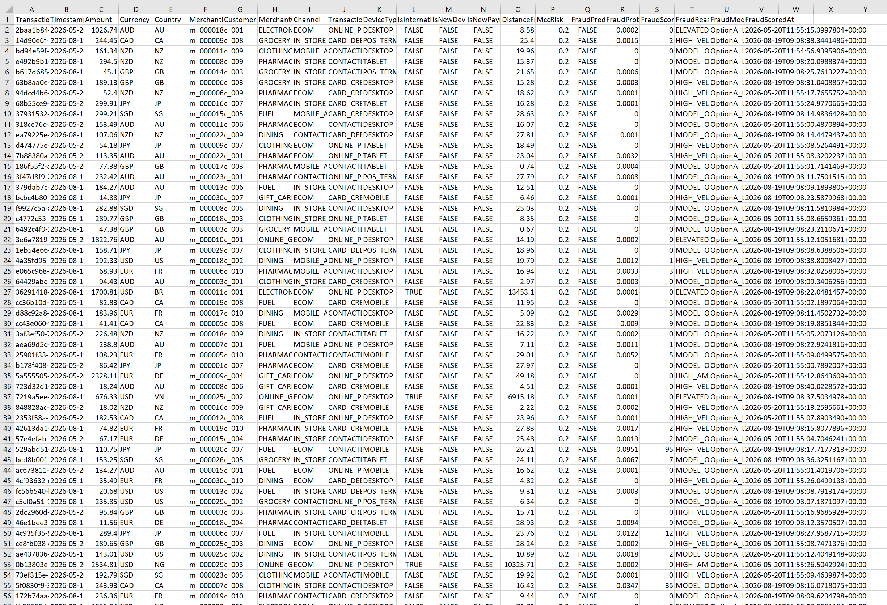

# Distributed Fraud Detection System


A production-style, event-driven fraud detection system built with **ASP.NET Core**, **RabbitMQ**, **SQL Server**, **Docker**, and **ML.NET**. The system simulates how financial institutions process and analyze transactions in a real-world event-driven architecture, combining backend microservices, asynchronous messaging, and machine learning inference. Pipeline: API → Database → Message Queue → Worker → ML Model → Fraud Score

---

## Overview

This project demonstrates how a modern financial fraud detection pipeline can be implemented using event-driven microservices and machine learning scoring.
The system processes transactions through several stages:

1. **TransactionService** exposes a REST API to create transactions.
2. Transactions are **persisted to SQL Server** via Entity Framework Core.
3. A **TransactionCreated** event is published to **RabbitMQ**.
4. **FraudDetectionWorker** consumes events asynchronously, computes engineered features, runs an **ML.NET model**, and writes fraud outputs back to the database.

The result is a full end-to-end loop where each transaction is enriched and scored with a real model output:

- **FraudProbability** (0.0–1.0)
- **FraudPrediction** (true/false)
- **FraudScore** (human-friendly scaled score)
- **FraudReason** (interpretable reason codes)
- **FraudModelVersion** and **FraudScoredAt** (traceability)

---

## Architecture

High-level system architecture:
```
                        +--------------------+
                        |  Transaction API   |
                        |  (ASP.NET Core)    |
                        +----------+---------+
                                   |
                                   v
                        +--------------------+
                        |     SQL Server     |
                        |   Transactions DB  |
                        +----------+---------+
                                   |
                                   v
                        +--------------------+
                        |      RabbitMQ      |
                        |  Event Messaging   |
                        +----------+---------+
                                   |
                                   v
                    +-----------------------------+
                    |     FraudDetectionWorker    |
                    |  Feature Engineering + ML   |
                    +-------------+---------------+
                                  |
                                  v
                        +--------------------+
                        |    ML.NET Model    |
                        |  Fraud Prediction  |
                        +----------+---------+
                                   |
                                   v
                        +--------------------+
                        |  Updated Transaction|
                        |  Fraud Metadata     |
                        +--------------------+
```

## Tech Stack

- **Language**: C# (.NET)
- **API**: ASP.NET Core Web API
- **Database**: SQL Server + Entity Framework Core
- **Messaging**: RabbitMQ (Docker)
- **Fraud Scoring**: ML.NET (Binary Classification, LightGBM)
- **Architecture**:
  - Layered API (Controllers → Services → Repositories → Persistence)
  - Event-driven integration (Publisher/Consumer)
  - Background worker service
  - Options/config-driven infrastructure (connection strings, model path, broker settings)
- **Infrastructure**: Docker + Docker Compose
- **Cloud Deployment**
  - Azure Container Apps
  - Azure SQL
- **CI/CD**: GitHub Actions

---

## Services

### TransactionService
**Responsibilities**
- Validates and accepts transaction requests
- Persists transactions to SQL Server
- Publishes `TransactionCreatedEvent` to RabbitMQ after successful persistence

**Key components**
- `TransactionsController`
- Domain model: `Transaction`
- DTOs: `CreateTransactionRequest`, `TransactionResponse`
- Service layer: `TransactionAppService`
- Repository layer: `EfTransactionRepository`
- Event publishing: `RabbitMqTransactionEventPublisher`

---

### FraudDetectionWorker
**Responsibilities**
- Consumes `TransactionCreatedEvent` messages from RabbitMQ
- Loads the transaction row from SQL Server (DB is source of truth)
- Computes and persists engineered features (customer/device/token state, velocity aggregates, MCC risk, geo signals)
- Runs an ML.NET model to produce a fraud probability and label
- Persists scoring outputs back to the transaction row

**Key components**
- `RabbitMqMessageConsumer` (durable queue, manual ack/nack)
- `TransactionCreatedHandler` (orchestrates pipeline + structured logging)
- `TransactionFeatureComputer` (feature engineering + state tables)
- `FraudModelPredictor` (loads model once, uses thread-local prediction engine)
- `TransactionDbContext` (transactions + state tables + risk tables)

---

## Data Model (High Level)

**Transactions table**
- Core fields: `Amount`, `Currency`, `CustomerId`, `MerchantId`, `Country`, `Timestamp`, etc.
- Engineered features: velocity, device/token novelty, geo distance, MCC risk, etc.
- Model outputs: `FraudProbability`, `FraudPrediction`, `FraudScore`, `FraudReason`, `FraudModelVersion`, `FraudScoredAt`

**State tables used for features**
- `CustomerProfileState` (account created at, age, home country)
- `CustomerDeviceState` (first-seen device tracking)
- `CustomerPaymentTokenState` (first-seen payment token tracking)
- `MerchantCategoryRisk` (reference risk values by merchant category)

---

## Event Flow

`POST /api/transactions`

⬇️

Persist transaction to SQL Server

⬇️

Publish `TransactionCreatedEvent`

⬇️

RabbitMQ queue: `transactions.created`

⬇️

FraudDetectionWorker consumes event

⬇️

Feature computation + ML prediction

⬇️

Update transaction with fraud outputs

---

## Current Status 

- ✅ Transaction ingestion API with validation + persistence
- ✅ RabbitMQ event publishing (durable messages, JSON payload)
- ✅ FraudDetectionWorker consumer service with manual ack/nack behavior
- ✅ Feature computation and stateful enrichment (device/token/profile tracking + velocity aggregates)
- ✅ ML.NET model integration with real probability output
- ✅ Predictions persisted back to SQL Server with versioning + timestamps
- ✅ End-to-end pipeline verified (API → DB → event → worker → updated DB record)
- ✅ Full distributed environment via Docker Compose
- ✅ Automatic model generation during bootstrap

---

## Results / Live Demo

The system has been load-tested end-to-end via the `/api/Transactions/simulate` endpoint, generating realistic synthetic transactions across multiple currencies, merchant categories, and channels, then scoring each one through the full pipeline (API → SQL Server → RabbitMQ → Worker → ML.NET → persisted fraud output).

### Simulation run — 2,001 transactions

| Metric | Value |
|---|---|
| Transactions submitted | 2,001 |
| Transactions scored | 2,001 (100%) |
| Fraud flagged | 49 (2.45%) |
| Legitimate | 1,952 |
| Average fraud probability | 0.0254 |
| Average fraud score | 25.3 / 100 |
| Highest single fraud probability | 1.0 |

### Fraud rate by merchant category

| Category | Transactions | Flagged | Fraud Rate |
|---|---|---|---|
| Luxury | 112 | 13 | 11.61% |
| Electronics | 106 | 10 | 9.43% |
| Online Gaming | 112 | 8 | 7.14% |
| Gift Cards | 270 | 18 | 6.67% |
| Grocery | 271 | 0 | 0% |
| Clothing | 344 | 0 | 0% |
| Fuel | 244 | 0 | 0% |
| Dining | 258 | 0 | 0% |

*Higher-value, low-friction categories (luxury goods, electronics, gift cards, online gaming) show materially higher fraud rates — consistent with real-world card-fraud patterns where these categories are commonly used for cash-out or reselling.*

### Sample scored output

Each transaction is enriched with a fraud probability, human-readable score, and interpretable reason code for traceability:



*Sample of transactions scored by the pipeline, including `FraudProbability`, `FraudScore`, `FraudReason`, and `FraudModelVersion` for full auditability.*

---

## Running Locally

## Docker Compose Environment

The system can run entirely in Docker using a single command.

### Services orchestrated by Docker Compose

- SQL Server
- RabbitMQ
- TransactionService
- FraudDetectionWorker
- Bootstrap container

The **bootstrap container** is responsible for:

- applying database migrations
- generating training data
- training the ML model if it does not exist

---

## Running the System

### Start the full distributed system

```bash
docker compose up --build
```
This will start:
- SQL Server
- RabbitMQ
- TransactionService
- FraudDetectionWorker
- bootstrap initialization container

## Swagger API

TransactionService Swagger UI:
```
http://localhost:5134/swagger/index.html
```
Example Endpoint 
```
POST /api/transactions
```

## RabbitMQ Management UI

```
http://localhost:15672
```
Credentials
```
Username: guest
Password: guest
```

## Model Training

Fraud model artifacts are generated automatically during bootstrap.

If the trained model does not exist, the bootstrap container will:
- Generate synthetic transaction training data
- Train the ML.NET fraud model
- Save the trained model to:
```
FraudModelTrainer.OptionA/Model/model.zip
```
## Force Model retraining
```
rm FraudModelTrainer.OptionA/Model/model.zip
docker compose up --build
```

## CI Pipeline
GitHub Actions automatically performs:
- dependency restoration
- solution build
- unit tests
- ML model generation
- Docker image validation
This ensures the system remains fully reproducible and buildable in CI environments.


## Development Roadmap

- [x] Implement Transaction domain model
- [x] Add EF Core and SQL Server persistence
- [x] Introduce service and repository layers
- [x] Add RabbitMQ event publishing
- [x] Add Fraud Detection worker (consumer service)
- [x] Integrate ML.NET fraud model
- [x] Dockerize full multi-service environment
- [x] Deploy to Azure or AWS
- [x] Additional POST/GET APIs for better system Demonstration

## License
MIT Licence

## Author
Carter Fitzgerald
Software Engineering — AI Systems & Backend Development

GitHub:
https://github.com/CarterFitzgerald
